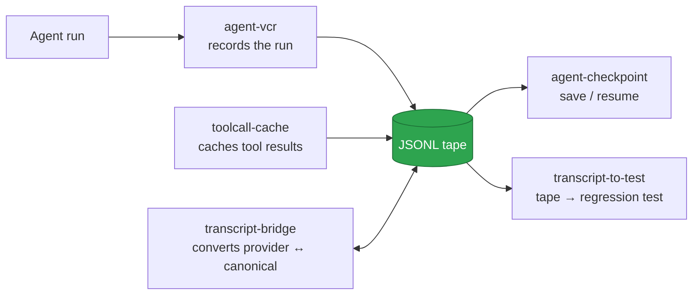

<div align="center">

# 🧪 LocalLab

### A local-first laboratory for building, debugging, and running AI agents.

[](#-the-tools)
[](LICENSE)
[](https://www.python.org/)
[](#philosophy)
[](#trust-model)
[](#contributing)

</div>

---

**LocalLab** is a collection of **10 small, sharp, local-first Python tools** for agentic work. Each tool lives in its own repo, does one job, runs fully on your machine, and installs with `pipx`. No accounts, no API keys in our code, no phone home.

Think of it as a **laboratory you own**: record agent runs, audit token spend, lint tool calls, cap costs, cache tool results, checkpoint state, convert transcripts between providers, and turn runs into regression tests — all offline, all under your control.

## ✨ Why this exists

The agent ecosystem is moving fast, but the tooling around it is mostly either:

- **Hosted SaaS that wants your API keys**, or
- **Heavy frameworks that do everything and own your workflow**.

There is a gap in the middle for **small, sharp, local-first tools** you can read end-to-end, run offline, and own completely. LocalLab fills that gap.

## 🎯 Who this is for

- **Agent builders** who want visibility into what their agents are actually doing.
- **Developers shipping agent features** who need regression tests for non-deterministic runs.
- **Teams watching model spend** who want hard spend caps and token forensics.
- **MCP ecosystem users** who want OpenAI-compatible bridges and local caching.
- **Anyone** who believes their agent session data should stay on their machine.

## 📦 The tools

### Debug & observability

| Tool | What it does | Install |
|------|--------------|---------|
| [agent-vcr](https://github.com/Victorchatter/AgentVCR) | Record and replay agent runs with tool outputs stubbed | `pipx install git+https://github.com/Victorchatter/AgentVCR.git` |
| [tokenauditor](https://github.com/Victorchatter/Tokenauditor) | Per-turn token breakdown + waste flags from any transcript | `pipx install git+https://github.com/Victorchatter/Tokenauditor.git` |
| [toolcall-linter](https://github.com/Victorchatter/toolcall-linter) | Lint agent tool calls against declared schemas | `pipx install git+https://github.com/Victorchatter/toolcall-linter.git` |
| [transcript-to-test](https://github.com/Victorchatter/transcript-to-test) | Turn a recorded run into a pytest regression test | `pipx install git+https://github.com/Victorchatter/transcript-to-test.git` |

### Runtime & orchestration

| Tool | What it does | Install |
|------|--------------|---------|
| [agent-circuit-breaker](https://github.com/Victorchatter/agent-circuit-breaker) | Hard-cap model spend per-run/per-day + kill switch | `pipx install git+https://github.com/Victorchatter/agent-circuit-breaker.git` |
| [toolcall-cache](https://github.com/Victorchatter/toolcall-cache) | Content-addressed cache for MCP tool results | `pipx install git+https://github.com/Victorchatter/toolcall-cache.git` |
| [agent-checkpoint](https://github.com/Victorchatter/agent-checkpoint) | Save/resume an agent run via a canonical JSONL tape | `pipx install git+https://github.com/Victorchatter/agent-checkpoint.git` |

### Interop & portability

| Tool | What it does | Install |
|------|--------------|---------|
| [transcript-bridge](https://github.com/Victorchatter/transcript-bridge) | Convert agent transcripts between provider formats | `pipx install git+https://github.com/Victorchatter/transcript-bridge.git` |
| [mcp-openai-bridge](https://github.com/Victorchatter/mcp-openai-bridge) | Expose MCP servers as OpenAI function-calling tools | `pipx install git+https://github.com/Victorchatter/mcp-openai-bridge.git` |
| [prompt-portability-linter](https://github.com/Victorchatter/prompt-portability-linter) | Flag vendor-locked features in your prompts | `pipx install git+https://github.com/Victorchatter/prompt-portability-linter.git` |

All 10 tools are **built, shipped, and installable today.**

See **[PROJECTS.md](PROJECTS.md)** for the deep-dive index: one-line summaries, CLI examples, local paths, specs, and seeds.

## 🚀 Quick start

Record a run, audit it, and lint its tool calls in three commands:

```bash
# 1. Record an agent run to a JSONL tape
agent-vcr record -- claude -p "refactor the auth module"

# 2. See exactly where your tokens went
tokenauditor tape.jsonl

# 3. Verify every tool call matches the declared schemas
toolcall-linter tape.jsonl --tools tools.json
```

## 🔗 How they fit together

Several projects share **one JSONL event envelope** — a *tape* — so a recording from one is consumable by another without coupling:



Each tool is **standalone** — install one, use it alone. Built in roughly the order above, later tools reuse earlier formats rather than forking them.

## 📥 Install the whole lab

```bash
pipx install git+https://github.com/Victorchatter/AgentVCR.git \
         git+https://github.com/Victorchatter/Tokenauditor.git \
         git+https://github.com/Victorchatter/toolcall-linter.git \
         git+https://github.com/Victorchatter/transcript-to-test.git \
         git+https://github.com/Victorchatter/agent-circuit-breaker.git \
         git+https://github.com/Victorchatter/toolcall-cache.git \
         git+https://github.com/Victorchatter/agent-checkpoint.git \
         git+https://github.com/Victorchatter/transcript-bridge.git \
         git+https://github.com/Victorchatter/mcp-openai-bridge.git \
         git+https://github.com/Victorchatter/prompt-portability-linter.git
```

Then run any tool by name:

```bash
agent-vcr record -- claude -p "fix the bug"
tokenauditor ~/.claude/projects/*/session.jsonl
toolcall-linter session.jsonl --tools tools.json
agent-circuit-breaker --run-budget 2.00 --daily-budget 20.00
transcript-bridge session.jsonl --from claude --to openai
```

See each tool's README for full usage.

## 🛡️ Trust model

- **No telemetry.** The tools never send usage data anywhere.
- **No accounts.** No signup, no cloud dashboard, no auth provider.
- **No hosted backend.** Everything runs on your machine.
- **Your keys stay with you.** The tools sit at wire-level boundaries; your API keys go only to the providers you choose.
- **MIT licensed.** Every tool and this umbrella are MIT-licensed.

## 🧱 Build a project yourself

Each project repo contains a `PROMPT.md` — a self-contained seed with the full design direction, constraints, and scope. To bootstrap one with a fresh Claude Code session:

```bash
git clone https://github.com/Victorchatter/<project>.git
cd <project>
claude            # then send:  @PROMPT.md
```

The prompt drives the full `design → spec → plan → implement` flow and stops at the spec-approval gate so you stay in control.

## 🤝 Contributing

This is a solo-founded family of tools, but issues and PRs are welcome on any project repo. Good first contributions:

- New transcript-format parsers for `tokenauditor` / `transcript-bridge`
- New vendor-lock rules for `prompt-portability-linter`'s `rules.yaml`
- New cacheability denylist entries for `toolcall-cache`
- Self-checks and edge-case reports from real agent runs

Please keep the philosophy: **local-first, small, MIT, no telemetry.**

## 📄 License

[MIT](LICENSE) — every tool in the lab and this umbrella.

---

<div align="center">

**[→ Full project index: PROJECTS.md](PROJECTS.md)**

Built by [Victor](https://github.com/Victorchatter) · 2026

</div>