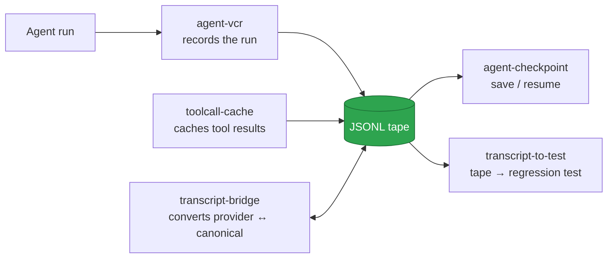

<div align="center">

# 🛠️ Open Source Projects

### A family of small, sharp, **local-first** tools for AI agent work.

[](LICENSE)
[](https://www.python.org/)
[](#philosophy)
[](#philosophy)
[](#contributing)

</div>

---

> **10 standalone tools for building, running, debugging, and porting AI agents.**
> Each one does one thing, runs fully on your machine, and ships as a `pipx`
> install. No accounts, no API keys in our code, no phone home.

This repository is the **umbrella** — an index and shared philosophy for the
family. Each project lives in its own repo and can be used independently.
See **[PROJECTS.md](PROJECTS.md)** for the full map with statuses and install
commands.

## ✨ Why this exists

The agent ecosystem is moving fast, and the tooling around it is either
**hosted SaaS that wants your API keys**, or **heavy frameworks that do
everything and own your workflow**. There's a gap in the middle for **small,
sharp, local-first tools** you can read end-to-end, run offline, and own
completely. These projects fill that gap.

## 🧭 Philosophy

- **Local-first.** Everything runs on your machine. No hosted backend, no
  telemetry, no accounts. Your API keys stay with you.
- **Small and sharp.** One tool, one job. Read the whole codebase in an
  afternoon. No plugin systems, no config DSLs, no web UIs unless the job
  demands one.
- **Framework-agnostic where it counts.** The tools sit at wire-level
  boundaries (the model API, the MCP tool layer, the transcript format) so
  they work with *any* agent, not just one vendor's.
- **Honest about loss.** When a conversion or a replay can't preserve
  something, it tells you — never silently drops information.
- **MIT, always.** Every project and this umbrella are MIT-licensed.

## 📦 The projects

| # | Project | Category | What it does | Status |
|---|---------|----------|--------------|:------:|
| 1 | [agent-vcr](https://github.com/Victorchatter/AgentVCR) | Debug | Record/replay agent runs with tool outputs stubbed | ✅ |
| 2 | [tokenauditor](https://github.com/Victorchatter/Tokenauditor) | Observability | Per-turn token breakdown + waste flags from any transcript | ✅ |
| 3 | [toolcall-linter](https://github.com/Victorchatter/toolcall-linter) | Debug | Lint agent tool calls against declared schemas | ✅ |
| 4 | [agent-circuit-breaker](https://github.com/Victorchatter/agent-circuit-breaker) | Runtime | Hard-cap model spend per-run/per-day + kill switch | ✅ |
| 5 | toolcall-cache | Runtime | Content-addressed cache for MCP tool results | ✅ |
| 6 | [agent-checkpoint](https://github.com/Victorchatter/agent-checkpoint) | Runtime | Save/resume an agent run via a canonical JSONL tape | 🚧 |
| 7 | transcript-bridge | Interop | Convert agent transcripts between provider formats | 📋 |
| 8 | mcp-openai-bridge | Interop | Expose MCP servers as OpenAI function-calling tools | 📋 |
| 9 | prompt-portability-linter | Interop | Flag vendor-locked features in your prompts | 📋 |
| 10 | transcript-to-test | Debug | Turn a recorded run into a pytest regression test | 📋 |

**Status:** ✅ built & shipped · 🚧 in progress · 📋 planned

> `toolcall-cache` and the four 📋 projects don't have their own GitHub repos
> linked yet — see [PROJECTS.md](PROJECTS.md) for local paths and build seeds.

## 🔗 How they fit together

Four projects share **one JSONL event envelope**, so a recording from one is
consumable by another — without coupling:



Each project is **standalone** — install one, use it alone. Built in roughly
the order above, later projects reuse earlier formats rather than forking them.

## 🚀 Install

Every project is `pipx`-installable from its own repo:

```bash
pipx install git+https://github.com/Victorchatter/AgentVCR.git
pipx install git+https://github.com/Victorchatter/Tokenauditor.git
pipx install git+https://github.com/Victorchatter/toolcall-linter.git
pipx install git+https://github.com/Victorchatter/agent-circuit-breaker.git
```

Then run the tool by name, e.g.:

```bash
agent-vcr record -- claude -p "fix the bug"
tokenauditor ~/.claude/projects/*/session.jsonl
toolcall-linter session.jsonl --tools tools.json
agent-circuit-breaker --run-budget 2.00 --daily-budget 20.00
```

See each project's README for full usage.

## 🧱 Building a project yourself

Each project folder contains a `PROMPT.md` — a self-contained seed with the
full design direction, constraints, and scope. To bootstrap one with a fresh
Claude Code session:

```bash
cd /path/to/<project>
claude            # then send:  @PROMPT.md
```

The prompt drives the full `design → spec → plan → implement` flow and stops
at the spec-approval gate so you stay in control.

## 🤝 Contributing

This is a solo-founded family of tools, but issues and PRs are welcome on any
of the project repos. Good first contributions:

- New transcript-format parsers for `tokenauditor` / `transcript-bridge`
- New vendor-lock rules for `prompt-portability-linter`'s `rules.yaml`
- New cacheability denylist entries for `toolcall-cache`
- Self-checks and edge-case reports from real agent runs

Please keep the philosophy: **local-first, small, MIT, no telemetry.**

## 📄 License

[MIT](LICENSE) — every project in the family and this umbrella.

---

<div align="center">

**[→ Full project index: PROJECTS.md](PROJECTS.md)**

Built by [Victor](https://github.com/Victorchatter) · 2026

</div>