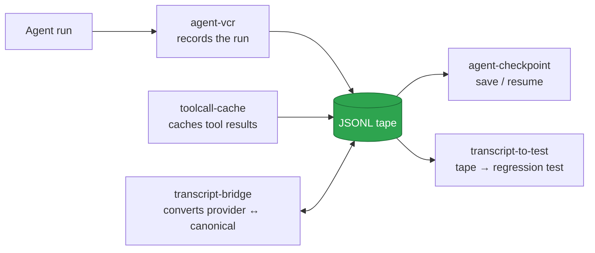

<div align="center">

# 🧪 LocalLab

### Ten local-first Python CLIs for AI agent work, sharing one tape format.

[](#-the-tools)
[](#-install-the-whole-lab)
[](LICENSE)
[](https://www.python.org/)
[](#philosophy)
[](#trust-model)
[](#contributing)

</div>

---

**LocalLab** is ten small Python CLIs for building, debugging, and running AI agents — recording runs, auditing token spend, linting tool calls, capping cost, caching tool results, checkpointing state, converting transcripts between providers, and turning runs into regression tests. Each tool lives in its own repo, does one job, runs fully on your machine, and installs with `pipx`. No accounts, no API keys of our own, no phone home.

## Why this exists, and why not just one tool

Most of these problems already have a solution somewhere. `tokenauditor` does roughly what [context-viewer](https://github.com/auditt98/context-viewer) does. `mcp-openai-bridge` is a narrower version of the more mature [MCP-Bridge](https://github.com/SecretiveShell/MCP-Bridge). The PyPI names `agent-circuit-breaker` and `agent-vcr` were already taken by unrelated projects when we got there, so those two install as `localab-circuit-breaker` and `localab-vcr` (repo and CLI names stay the same). If you're evaluating any single tool in this family against its category, assume a competitor exists and go look — most of the time you'll find one.

What doesn't exist, as far as we've found, is the *set*: ten tools built against one JSONL tape envelope. One tape recorded by `agent-vcr` is read by `tokenauditor` — which gets an *exact* system+tools prefix from it instead of an inferred one — converted by `transcript-bridge`, and turned into a pytest regression by `transcript-to-test`. Each of those has a selfcheck asserting it, running in CI on every push, so the claim can't quietly stop being true. MIT, no telemetry, no hosted backend, `pipx`-installable, and — unlike most of the one-off prior art above — all ten with green CI (Python 3.10 and 3.13, a real `pip install -e .` + `selfcheck.py` run per push, not a badge nobody wired up). A coherent family rather than ten repos that happen to share an author. That's the part we're actually claiming, and it's the reason this exists as a "lab" instead of shipping the strongest tool alone.

## 🎯 Who this is for

- **Agent builders** who want visibility into what their agents are actually doing.
- **Developers shipping agent features** who need regression tests for non-deterministic runs.
- **Teams watching model spend** who want hard spend caps and token forensics.
- **MCP ecosystem users** who want OpenAI-compatible bridges and local caching.
- **Anyone** who believes their agent session data should stay on their machine.

## 📦 The tools

### Debug & observability

| Tool | What it does | Install |
|------|--------------|---------|
| [agent-vcr](https://github.com/Victorchatter/AgentVCR) | Record and replay agent runs with tool outputs stubbed | `pipx install localab-vcr` |
| [tokenauditor](https://github.com/Victorchatter/Tokenauditor) | Per-turn token breakdown + waste flags from any transcript | `pipx install tokenauditor` |
| [toolcall-linter](https://github.com/Victorchatter/toolcall-linter) | Lint agent tool calls against declared schemas | `pipx install toolcall-linter` |
| [transcript-to-test](https://github.com/Victorchatter/transcript-to-test) | Turn a recorded run into a pytest regression test | `pipx install transcript-to-test` |

### Runtime & orchestration

| Tool | What it does | Install |
|------|--------------|---------|
| [agent-circuit-breaker](https://github.com/Victorchatter/agent-circuit-breaker) | Hard-cap model spend per-run/per-day + kill switch | `pipx install localab-circuit-breaker` |
| [toolcall-cache](https://github.com/Victorchatter/toolcall-cache) | Content-addressed cache for MCP tool results | `pipx install toolcall-cache` |
| [agent-checkpoint](https://github.com/Victorchatter/agent-checkpoint) | Save/resume an agent run via a canonical JSONL tape | `pipx install localab-checkpoint` |

### Interop & portability

| Tool | What it does | Install |
|------|--------------|---------|
| [transcript-bridge](https://github.com/Victorchatter/transcript-bridge) | Convert agent transcripts between provider formats | `pipx install transcript-bridge` |
| [mcp-openai-bridge](https://github.com/Victorchatter/mcp-openai-bridge) | Expose MCP servers as OpenAI function-calling tools | `pipx install mcp-openai-bridge` |
| [prompt-portability-linter](https://github.com/Victorchatter/prompt-portability-linter) | Flag vendor-locked features in your prompts | `pipx install prompt-portability-linter` |

All 10 tools are **built, shipped, and installable today.**

See **[PROJECTS.md](PROJECTS.md)** for the deep-dive index: one-line summaries, CLI examples, local paths, specs, and seeds.

## 🚀 Quick start

Record a run, audit it, and lint its tool calls in three commands:

```bash
# 1. Record an agent run to a JSONL tape
agent-vcr record -- claude -p "refactor the auth module"

# 2. See exactly where your tokens went
tokenauditor tape.jsonl

# 3. Verify every tool call matches the declared schemas
toolcall-linter tape.jsonl --tools tools.json
```

## 🔗 How they fit together

Several projects share **one JSONL event envelope** — a *tape* — so a recording from one is consumable by another without coupling:


```mermaid
flowchart LR
    Run["Agent run"] --> VCR["agent-vcr<br/>records the run"]
    VCR --> Tape[("JSONL tape")]
    Cache["toolcall-cache<br/>caches tool results"] --> Tape
    Tape --> Check["agent-checkpoint<br/>save / resume"]
    Tape --> T2T["transcript-to-test<br/>tape → regression test"]
    Bridge["transcript-bridge<br/>converts provider ↔ canonical"] <--> Tape
    style Tape fill:#2EA44F,color:#fff,stroke:#1a6b33
```

Each tool is **standalone** — install one, use it alone. Built in roughly the order above, later tools reuse earlier formats rather than forking them.

## 📥 Install the whole lab

```bash
pipx install localab-vcr \
         tokenauditor \
         toolcall-linter \
         transcript-to-test \
         localab-circuit-breaker \
         toolcall-cache \
         localab-checkpoint \
         transcript-bridge \
         mcp-openai-bridge \
         prompt-portability-linter
```

Then run any tool by name:

```bash
agent-vcr record -- claude -p "fix the bug"
tokenauditor ~/.claude/projects/*/session.jsonl
toolcall-linter session.jsonl --tools tools.json
agent-circuit-breaker --run-budget 2.00 --daily-budget 20.00
transcript-bridge session.jsonl --from claude --to openai
```

See each tool's README for full usage.

## 🌂 The `locallab` umbrella CLI

Install the umbrella package to manage the whole lab from one command:

```bash
pipx install locallab
```

Available commands:

```bash
locallab install-all   # install all 10 tools via pipx (network)
locallab update        # upgrade every installed LocalLab tool (network)
locallab versions      # show installed versions (offline)
locallab doctor        # smoke-test every installed tool (offline)
locallab pipeline <recipe.yaml>  # run a cross-tool recipe (offline when local)
```

Example pipeline recipe (`locallab/recipes/record-audit-lint.yaml`):

```yaml
name: record-audit-lint
steps:
  - run: agent-vcr record -o tape.jsonl -- {agent_cmd}
  - run: tokenauditor tape.jsonl --cost --cost-json -o audit.json
  - run: toolcall-linter tape.jsonl --tools tools.json --format sarif -o lint.sarif
  - run: transcript-to-test tape.jsonl -o test_regression.py
  - assert:
      file: audit.json
      jq: '.total_cost <= 2.00'
  - assert:
      file: lint.sarif
      jq: '.runs[0].results | length == 0'
```

Run with `--dry-run` to preview commands without executing them. See `locallab/recipes/` for more examples.

**Network requirements:** `install-all` and `update` require network access; `versions`, `doctor`, and `pipeline` are offline when using local recipes and installed tools.

## 📚 Cookbook

The `examples/` directory has runnable recipes that combine multiple LocalLab
tools:

| Recipe | What it shows |
|---|---|
| [`cap-claude-code-spend.md`](examples/cap-claude-code-spend.md) | Run Claude Code through `agent-circuit-breaker` with a $5 cap. |
| [`cache-filesystem-mcp.md`](examples/cache-filesystem-mcp.md) | Cache an MCP filesystem server with `toolcall-cache`. |
| [`regression-test-from-tape.md`](examples/regression-test-from-tape.md) | Record with `agent-vcr`, generate a test with `transcript-to-test`, run it in CI. |
| [`portability-check-before-migration.md`](examples/portability-check-before-migration.md) | Lint prompts with `prompt-portability-linter` before switching providers. |
| [`resume-long-run.md`](examples/resume-long-run.md) | Save and resume a long run with `agent-checkpoint`. |

Each recipe includes copy-paste commands, expected output, and why it matters.

## 📊 Benchmarks

Published benchmark results for the performance-sensitive tools are kept in
each tool's `benchmarks/` directory:

| Tool | Latest results |
|---|---|
| [agent-circuit-breaker](https://github.com/Victorchatter/agent-circuit-breaker/tree/main/benchmarks) | overhead benchmark |
| [agent-vcr](https://github.com/Victorchatter/AgentVCR/tree/main/benchmarks) | record/replay overhead |
| [toolcall-cache](https://github.com/Victorchatter/toolcall-cache/tree/main/benchmarks) | cache hit/put latency |
| [agent-checkpoint](https://github.com/Victorchatter/agent-checkpoint/tree/main/benchmarks) | resume cost |

Each `benchmarks/README.md` summarizes the latest numbers. Results are updated
automatically on release tags via GitHub Actions and committed to
`benchmarks/results/`.

## 🛡️ Trust model

- **No telemetry.** The tools never send usage data anywhere.
- **No accounts.** No signup, no cloud dashboard, no auth provider.
- **No hosted backend.** Everything runs on your machine.
- **Your keys stay with you.** The tools sit at wire-level boundaries; your API keys go only to the providers you choose.
- **MIT licensed.** Every tool and this umbrella are MIT-licensed.

## 🧱 Build a project yourself

Each project repo contains a `PROMPT.md` — a self-contained seed with the full design direction, constraints, and scope. To bootstrap one with a fresh Claude Code session:

```bash
git clone https://github.com/Victorchatter/<project>.git
cd <project>
claude            # then send:  @PROMPT.md
```

The prompt drives the full `design → spec → plan → implement` flow and stops at the spec-approval gate so you stay in control.

## 🤝 Contributing

This is a solo-founded family of tools, but issues and PRs are welcome on any project repo. Good first contributions:

- New transcript-format parsers for `tokenauditor` / `transcript-bridge`
- New vendor-lock rules for `prompt-portability-linter`'s `rules.yaml`
- New cacheability denylist entries for `toolcall-cache`
- Self-checks and edge-case reports from real agent runs

Please keep the philosophy: **local-first, small, MIT, no telemetry.**

## 📄 License

[MIT](LICENSE) — every tool in the lab and this umbrella.

---

<div align="center">

**[→ Full project index: PROJECTS.md](PROJECTS.md)**

Built by [Victor](https://github.com/Victorchatter) · 2026

</div>
